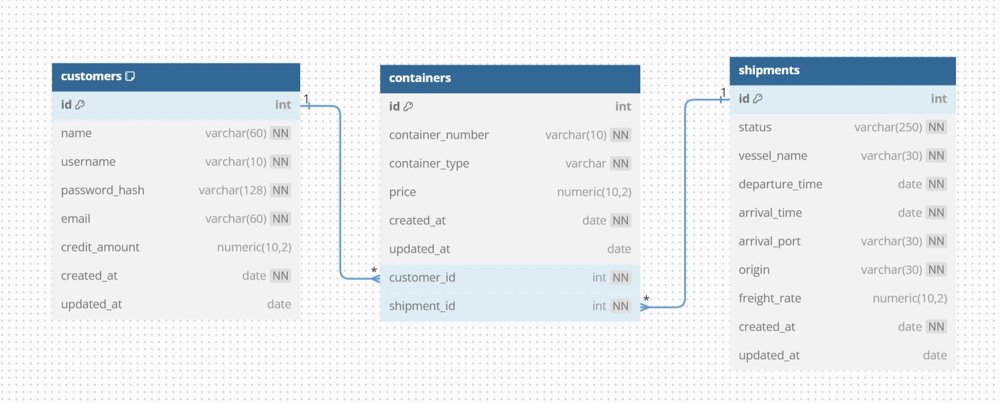
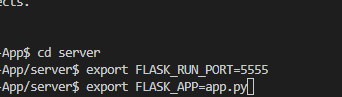
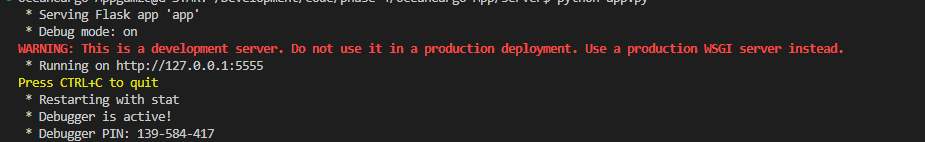
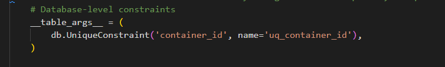

# OceanCargo App

### Overview

This is Flask-based RESTful API of the OceanCargo App, a web application designed to manage ocean cargo bookings. The app allows user to view their shipments and remaining credit amount information on the Home page, book a shipment based on the schedule provided on 'Shipments' page and sign up. API endpoints handle session checks, log in/log out , sign up, querying shipments for a specific customer along with the update and delete actions with full CRUD support.

The app is configured to Flask-SQL Alchemy, Flask-Retful, and Flask-Migrate extensions to manage the database transactions. The API is designed based on RESTful conventions and JSON serialization.

### Features

- Customer authentication (login, logout, session management)
- Customer management (create, update)
- Shipment booking and management (create, read, update, delete)
- Container and Shipment association
- RESTful API with serialized JSON response
- Database migrations with Flask-Migrate

### Extensions and Backend Technologies Used

- Python 3.8.11
- Flask 
- Flsk-SQLAlchemy
- Flask-RESTful
- Flask-Migrate
- SQLite

### Project Structure 

├── app.py                 # Main application and API resource file

├── models.py              # Database models

├── migrations/            # Database migration files

├── seed.py                # Database seeding script

├── instance/              # SQLite database instance

├── README.md              # Project documentation

### Installation

Clone the repository with <em>git clone "https://github.com/Gamze1314/OceanCargo-App"</em> command, and cd into OceanCargo-App directory.
You will need to create virtual environment and activate it with '<em>pipenv install</em> and '<em>pipenv shell</em>' commands respectively.

Install the required packages:

* pip install Flask
* pip install Flask-SQLAlchemy
* pip install Flask-RESTful
* pip install Flask-Migrate
* pip install ipdb
* pip install Faker

Set up the database:

* flask db init
* flask db migrate -m
* flask db upgrade

Run the application:

python app.py

### Configurations

The configuration settings are managed in the app.py such as the database URI, secret keys, and other Flask settings.

Setting Command Options

To set the port for the run command, instead of using below set up:

set the FLASK_RUN_PORT and FLASK_APP as shown below, and simply run flask run.

### API Endpoints 

- /check_session (GET): Check if a user is logged in
- /login (POST): Log in a user
- /logout (DELETE): Log out a user 
- /shipments (GET): Get all shipments
- /customers (POST): Create a new customer
- /customer/id (PATCH): Update a customer information
- /shipments/customr/customer_id (GET, POST, PATCH, DELETE): Manage shipments for a specific customer.
- /containers (GET): Get all containers

### Models

- Customer
- Shipment
- Container
- ShipmentContainerAssociation

### Authentication

This API uses session-based authentication. Users need to log in to access protected routes.

<strong>Login Process</strong>

The /login endpoint handles user authentication. It expects a POST request with a username. The server checks if the username exists in the database. If found, it creates a session for the user by storing the 'customer_id'. The session is maintained using Flask's session object, which uses a signed cookie to store session data.

<strong>Session Management</strong>

The /check_session resource (endpoint) verifies if a user is logged in. It checks for the 'customer_id' in the session data, then returns customer's information indicating an active session.

<strong>Logout</strong>

The /logout endpoint handles user logout. It clears the session by deleting the 'customer_id' session data, effectively logging out the user.

Several routes (like posting a shipment) check for an active session before allowing access. If no valid session found, these routes will return 401 Unauthorized error.
This application uses a secret key to sign the session data, preventing tampering.

To generate a secret key, run below code in the terminal:

* python -c 'import os; print('os.urandom(16))

### Validation Rules

Customer Creation:

* Username: Must be 5-10 characters long and unique.
* Email: Must include an '@' symbol.
* Customer Type: Must be either 'consignee' or 'forwarder'.
* Credit Amount: Must be a number, and greater than 20,000.

Shipment Booking:

Checks for required fields (origin, vessel_name, container_type, comment).
Verifies if the shipment is available for booking (The status can not be 'In Transit' for shipment booking.).

Comment Update:

Ensures the comment is provided and between 1-50 characters long.

General Validations:

Proper error handling for missing required fields.

Type checking for numeric fields.

Database integrity checks (unique constraints): Each shipment can have unique container_id. 

### Error Handling 

The API includes basic error handling for common scenarios such as invalid input, unauthorized access, and resource not found.

### Development 

This project uses Flask's built-in development server. Debug mode is enabled for development purposes. The <strong>run</strong> command starts the development server.

