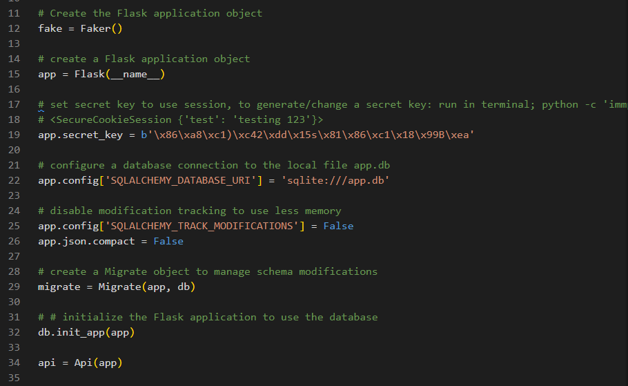

# OceanCargo App

### Overview

This is the backend for the OceanCargo App, a web application designed to manage ocean cargo bookings, login, log out and sign up functionalities. The app allows user to view their shipments and remaining credit amount information on the Home page, book a shipment based on the schedule provided on 'Shipments' page and sign up. API endpoints handle session checks, log in/log out , sing up, querying shipments for a specific customer along with update and delete actions.

The app is configured to Flask-SQL Alchemy, Flask-Retful, and Flask-Migrate extensions to manage the database transactions. The API is designed based on RESTful conventions and JSON serialization.

### Features

- Customer authentication and management
- Shipment booking and management
- Container and Shipment association
- RESTful API with serialized JSON response
- Database migrations with Flask-Migrate

### Technologies

- Python 3.8.11
- Flask 
- Flsk-SQLAlchemy
- Flask-RESTful
- Flask-Migrate
- SQLite

### Project Structure 

├── app.py                 # Main application and API resource file

├── models.py              # Database models

├── migrations/            # Database migration files

├── seed.py                # Database seeding script

├── instance/              # SQLite database instance

├── README.md              # Project documentation

### Installation

Clone the repository with <em>git clone "https://github.com/Gamze1314/OceanCargo-App"</em> command, and cd into OceanCargo-App directory.
You will need to create virtual environment and activate it with '<em>pipenv install</em> and '<em>pipenv shell</em>' commands respectively.

### Configurations

The configuration settings are managed in the app.py such as the database URI, secret keys, and other Flask settings.

 - app.py 

