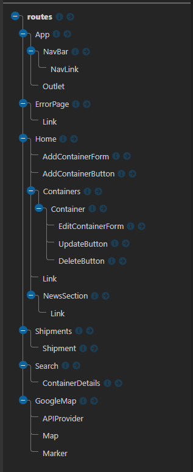

# Ocean Cargo App

### Overview

Welcome to Ocean Cargo App! This is a Flask-based full-stack web application designed to streamline the workflow of US Inbound Ocean Operations Team. This app has a standout feature: Unique shipment data that enables visibility for users to quickly access container information such as total cost, container unit price, arrival time. This allows for faster decisin making and greater operational efficiency for ocean shipments arriving into the United States. The API endpoints are designed by RESTful conventions to manage HTTP requests to add container for a specific shipment route, update and delete a container for the selected shipment route. Users can easily manage containers and track their total shipment cost, and container price accordingly. The container types and price are set to fixed values for the ease of use. React for the front-end user interface and Python with Flask for theback-end server, ensuring robust, scalable, and interactive application.

The app is configured to Flask-SQL Alchemy, Flask-Retful, and Flask-Migrate extensions to manage the database transactions.

### Expected Outcomes

Upon completion, the ocean cargo management tool will:

* Reduce the time and effort required for operations team or logistic specialist to find shipment/container information
* Enchance the accuracy of ocean booking pricing information available to customers, brokers, managers leading to better service for U.S importers.
* Increase the volume of U.S bound shipments and the productivity of U.S Importers.

### Features

- Container management (create, read, update, delete)
- Container and Shipment association
- RESTful API with serialized JSON response
- Database migrations with Flask-Migrate
- Google Map API Integration
- Container Search by container number

### Extensions and Backend Technologies Used

- Python 3.8.13
- Flask 3.0.3
- Flask-SQLAlchemy
- Flask-RESTful
- Flask-Migrate
- SQLite

### Frontend Technologies Used

- JavaScript
- React.js
- React-router-dom
- Tailwind CSS
- Formik
- Yup
- Google Maps API

### Installation

Clone the repository with <em>git clone "https://github.com/Gamze1314/OceanCargo-App"</em> command, and cd into OceanCargo-App directory.
You will need to create virtual environment and activate it with '<em>pipenv install</em> and '<em>pipenv shell</em>' commands respectively.

Install the required packages:

* pip install Flask
* pip install Flask-SQLAlchemy
* pip install Flask-RESTful
* pip install Flask-Migrate
* pip install ipdb
* pip install Faker

Set up the database:

* flask db init
* flask db migrate -m
* flask db upgrade

Run the Flask server:

python app.py

Run React server:

npm run start

* If you wish to have gunicorn and honcho installed ro run both servers with one command, set up Procfile.dev to configure the web and api.

web: PORT=4000 npm start --prefix client
api: gunicorn -b 127.0.0.1:5555 --chdir ./server app:app

In terminal, you only need to run ‘honcho start -f Procfile.dev’, after setting up Procfile.dev file as above.

### Configurations

The configuration settings, and app initializations are managed in the app.py such as 'SQLALCHEMY_TRACK_MODIFICATIONS' , 'SQLALCHEMY_DATABASE_URI'.

### API Endpoints 

- '/shipments' (GET): Gets all shipments.
- '/containers' (GET, POST): Manages new container creation and GET requests.
- '/containers/<int:id>' (GET, PATCH, DELETE): Feches a container by id, delete and update.

### Models

- Customer : Customer can have multiple shipments.
- Shipment : A shipment can have multiple containers.
- Container :  The container is a junction point between shipment and container models.

### Flask-SQLAlchemy Relationships Set up

The relationships between Container-Customer and Shipment-Container models are set up as one-to-many SQL Alchemy db.relationship() costructor.
The relationship between Shipment-Customer is many-to-many relationship.
The customer has many shipments through the container model. The association proxy provides the customer's shipments through the container table.

### Validation and Constraints

Customer Creation:

* Username: Must be 5-10 characters long and unique.
* Email: Must include an '@' symbol.
* Credit Amount: Must be a type of Numberic subclass, and greater than 20,000.
* Customer name : It can not be same as customer's username attribute.

Container Creation: 

* Container number: Must be unique, and a type of String containing 4 letters and 6 digits.
* Price : The container price is between 3500 and 10,000 in value, and has a hybrid property method to calculate total cost.

Shipment Creation:

* Constraint for arrival time: The arrival time can not be same as departure time.
* Freight rate: Must be a numberic with 2 floating point numbers.
* Status: Must be a string containing not more than 250 characters.

Origin and Arrival Ports: 
* Arrival and Destination Ports are pre-determined for 6 different arival and origin ports for display only on Google Maps. The coordinations are defined in client>src>data directory.

### Development 

This project uses Flask's built-in development server. Debug mode is enabled for development purposes. The <strong>below</strong> code starts the development server.

if __name__ == '__main__':
    app.run(port=5555, debug=True) 

### Frontend Component Hieararchy

### Frontend API Overview

The app utilizes React Context and the Fetch API for backend communication:

Fetch Shipments Data and Display on Home Page

Endpoint: /shipments
Method: GET
Action: Retrieve and set the list of shipments along with associated containers.

Add Container for the Selected Shipment

Endpoint: /containers
Method: POST
Action: Add a new container to a shipment.

Delete Container 

Endpoint: /containers/{containerId}
Method: DELETE
Action: Remove a container from a shipment.

Update Container

Endpoint: /containers/{containerId}
Method: PATCH
Action: Modify container details.

Search Container

Endpoint: /container/{containerNumber}
Method: GET
Action: Retrieve container details by container number.

Error Handling for all API calls: Alerts the user on failure and updates state upon success.

### Future amendments to be added

* Log in/Log out Functionality: Implement user authentication using session data, allowing customers to log in and log out securely. This includes integrating authentication systems like JWT or OAuth to manage sessions and ensure secure access to customer-specific data.

* Book a Shipment Route: Allow logged-in customers to book shipment routes and add new containers to their existing or new shipments. This feature will manage user bookings, ensuring only authenticated users can make reservations and update shipment details.

* Arrival and Departure Port Backend Support: Extend the backend to handle a wider variety of routes by adding support for multiple arrival and departure ports. This will increase the flexibility of route management and offer more options for customers when booking shipments.

### Contributing

Contributions are welcome! Please fork the repository and use a feature branch. 

