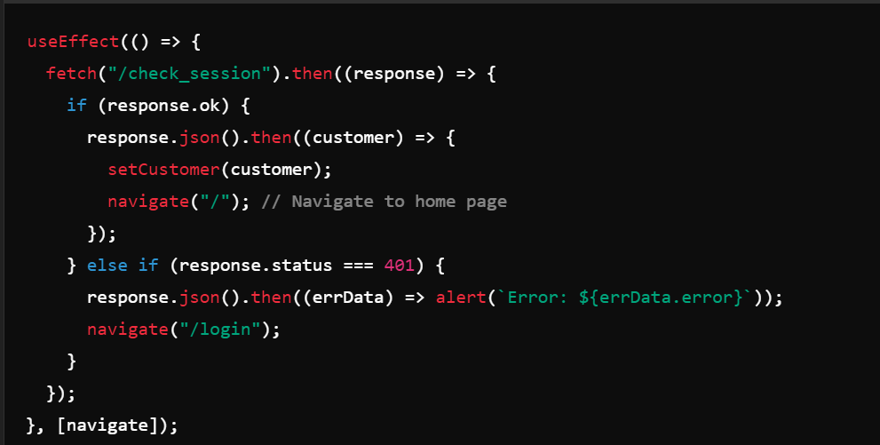
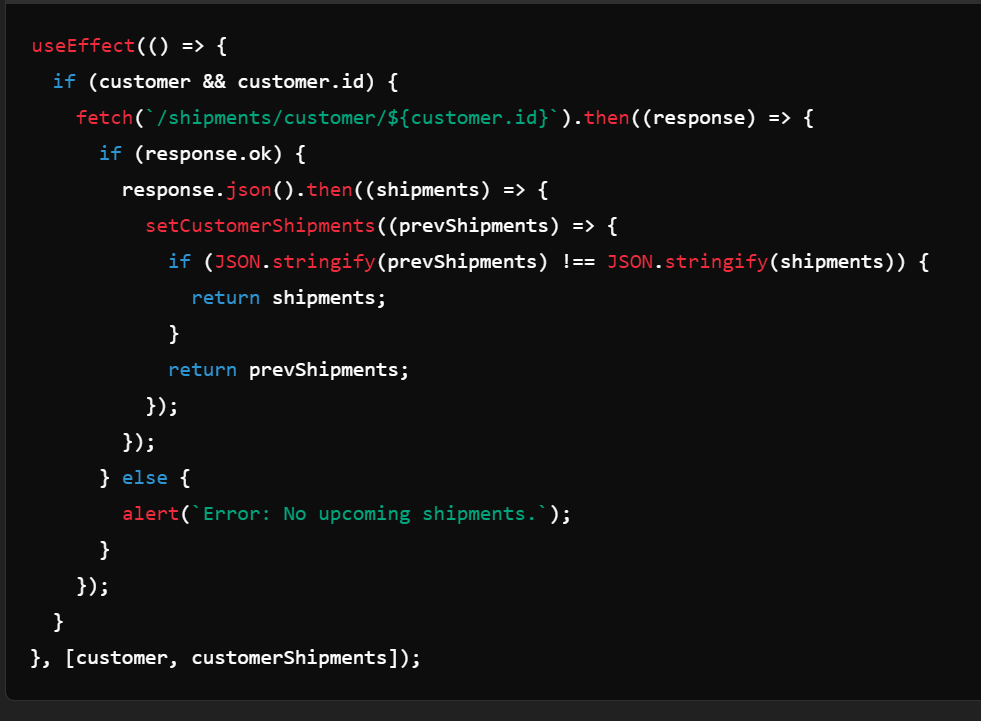

# OceanCargo React Frontend

### Overview

The OceanCargo app is SPA designed for managing shipments and customer information. This React-based frontend interacts with Flask-based backend to provide users functionalities such as booking shipments, viewing shipment schedules, managing their profiles.

### Features

- User Authentication: Sign up, log in, and log out functionality for customer.
- Ocean Shipment Booking: Customers can book shipments, view their bookings nd remaining credit amount on dashboard personalized to each customer.
- User Profile Management: Customer can update their account information.
- Responsive Design: The application is designed to be responsive and works on various screen sizes.

### Project Structure 

OceanCargo-App-client/

├── src/

│   │   ├── NavBar.js          # Navigation bar component

│   │   ├── Login.js           # Login component

│   │   ├── SignUp.js          # Sign up component

│   │   ├── Shipments.js       # Component to display all shipments

│   │   ├── UserProfile.js      # Profile management component

│   │   ├── NewBookingForm.js     # Shipment booking form

│   ├── assets/

│   │   └── logo.jpg           # Logo image used in NavBar

│   │   └── img1.jpg           # Container image used in Home Page

│   │   └── img2.jpg           # Second Container image used in Home Page

│   ├── index.css              # Global CSS styles

│   ├── App.js                 # Main App component

│   ├── index.js               # Entry point of the application

├── public/

│   └── index.html             # HTML template

├── package.json               # Node.js dependencies and scripts

├── README.md                  # Project documentation

└── tailwind.config.js          # Tailwind CSS configuration and plugins

### Set up and Installations

Download Node.js to utilize runtime environment for this project. Link: [nodejs.org.](https://nodejs.org/en) 

- git clone https://github.com/Gamze1314/OceanCargo-App 
- cd into client directory
- npm install 
- In the project directory, you can run: npm start

Runs the app in the development mode.\
Open [http://localhost:4000](http://localhost:4000) to view it in your browser. 'package.json' file contains 'start' script with PORT=4000 configuration and proxy set up for the backend communication for 'http://127.0.0.1:5555' which allows the cross-origin resource sharing.

Proxy:

### Front-end Technologies Used

- JavaScript
- React.js
- React-router-dom
- Tailwind CSS
- Formik
- Yup

### Routes and Router Configuration

The routing is managed using 'react-router-dom' , which allows dynamic and nested routing. The router is created using 'createBrowserRouter' function defining all routes that application supports.
Based on the URL path defined components will be rendered.

- Top-level router structure starts with the path '/', renders the App component as the root element.
- The App components will render different children componenets based on the routes plugging in with 'Outlet' in the app.js file. Check out /client/routes.js path.
- ErrorElement is specified to handle the cases where route patch is invalid or an error occurs during the programmatic navigation.

### API Interaction Overview

The frontend interacts with the API to manage customer data, shipments, and customer specific shipments.

Key API functions in app.js

1. Check Customer Session : When the 'App' component is mounted, it sends a 'GET' HTTP request to '/check_session' to verify if a customer is already logged in. If the customer is authenticated, their data is stored in the state and they are ridirected to the home page. If not, the user is redirected to login page.

2. Fetch all Shipments : On component mount, the app fetches all shipments and stores in the 'shipments' state. The endpoint for this 'GET' request is '/shipments'.

3. Fetch Customer-Specific Shipments : If a customer is logged in, 'GET' request will be sent to `/shipments/customer/<customer_id>`  Resource to retrieve the shipments for the specific customer(already logged in). 

4. Update a Shipment : In the handleUpdate function, 'PATCH' request is sent to `/shipments/customer/<customer_id>` API endpoint to update the shipment allowing user to send 'comment' belongs to 'ShipmentContainerAssociation' table.

5. Delete a Shipment : The handleDelete function sends 'DELETE' request to `/shipments/customer/<customer_id>` API endpoint to delete the shipment from the database, and reflects the change in the 'customerShipments' state.

6. Customer Login : The logInCustomer function sends a 'POST' request to '/login' , and updates the 'customer' state , then redirecting user to the home page.

7. Customer Logout : The function logOutCustomer logs the customer out by sending 'DELETE' request to /logout API endpoint, then updates both customer and customerShipments states to initial values.

8. Book a Shipment : The function bookShipment handles 'POST' request to `/shipments/customer/<customer_id>` API endpoint to create a new shipment in the database. if successful, the state is updated with new shipment information and the customer's credit amount is being after the deduction of ocean freight cost. 

9. Update Customer Account : The function handleAccountUpdate manages 'PATCH' request to the backend with only updated 'email', 'username', and 'type'(account type can only be selected as "forwarder" or "consignee") fields in the request body.

10. Customer Signup : The handleSignup function handles signup process with a 'POST' request to /customers endpoint.

### Contributions

Contributions are welcome! Please fork the repository and use a feature branch.