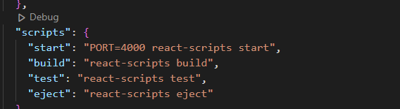
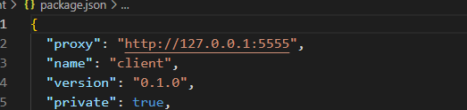

# OceanCargo React Frontend

### Overview

The OceanCargo app is SPA designed for managing shipments and customer information. This React-based frontend interacts with Flask-based backend to provide users functionalities such as booking shipments, viewing shipment schedules, managing their profiles.

### Features

- Global State Management & React Context API: Utilizes React Context to manage and share state across components. This includes managing shipment data, container information globally
- React Router : Uses react-router-dom for client-side routing, enabling navigation between different pages (e.g., Home, Shipments, Search Container, Map) without full page reloads.
- Responsive Design: The application is designed to be responsive and works on various screen sizes.
- Tailwind CSS: Leverages Tailwind CSS to create a flexible and responsive UI. This includes using utility classes to adjust layout, spacing, and styling based on screen size
- Error Handling: Implements error boundaries and route error handling to provide users with meaningful feedback and manage error scenarios gracefully.

### Set up and Installations

Download Node.js to utilize runtime environment for this project. Link: [nodejs.org.](https://nodejs.org/en) 

- git clone https://github.com/Gamze1314/OceanCargo-App 
- cd into client directory
- npm install 
- In the project directory, you can run: npm start

Runs the app in the development mode.\
Open [http://localhost:4000](http://localhost:4000) to view it in your browser. 'package.json' file contains 'start' script with PORT=4000 configuration and proxy set up for the backend communication for 'http://127.0.0.1:5555' which allows the cross-origin resource sharing.

Proxy:

### Front-end Technologies Used

- JavaScript
- React.js
- React-router-dom
- Tailwind CSS
- Formik
- Yup
- Google Maps API

### Routes and Router Configuration

In routes.js file, the routing is managed using 'react-router-dom' , which allows dynamic and nested routing. The router is created using 'createBrowserRouter' function defining all routes that application supports.
Based on the URL path defined components will be rendered.

- Top-level router structure starts with the path '/', renders the App component as the root element.
- The App components will render different children componenets based on the routes plugging in with 'Outlet' in the app.js file. Check out /client/routes.js path.
- ErrorElement is specified to handle the cases where route patch is invalid or an error occurs during the programmatic navigation.

### API Interaction Overview

OceanCargo utilizes React Context and the Fetch API for backend communication:

Fetch Shipments Data

Endpoint: /shipments
Method: GET
Purpose: Retrieve and set the list of shipments.
Error Handling: Alerts if data is missing or if fetch fails.

Add Container

Endpoint: /containers
Method: POST
Purpose: Add a new container to a shipment.
Error Handling: Alerts on failure and updates state upon success.

Delete Container

Endpoint: /containers/{containerId}
Method: DELETE
Purpose: Remove a container from a shipment.
Error Handling: Alerts on failure and updates state upon success.

Update Container

Endpoint: /containers/{containerId}
Method: PATCH
Purpose: Modify container details.
Error Handling: Alerts on failure and updates state upon success.

Search Container

Endpoint: /container/{containerNumber}
Method: GET
Purpose: Retrieve container details by number.
Error Handling: Alerts if not found or on failure.

### Contributions

Contributions are welcome! Please fork the repository and use a feature branch.